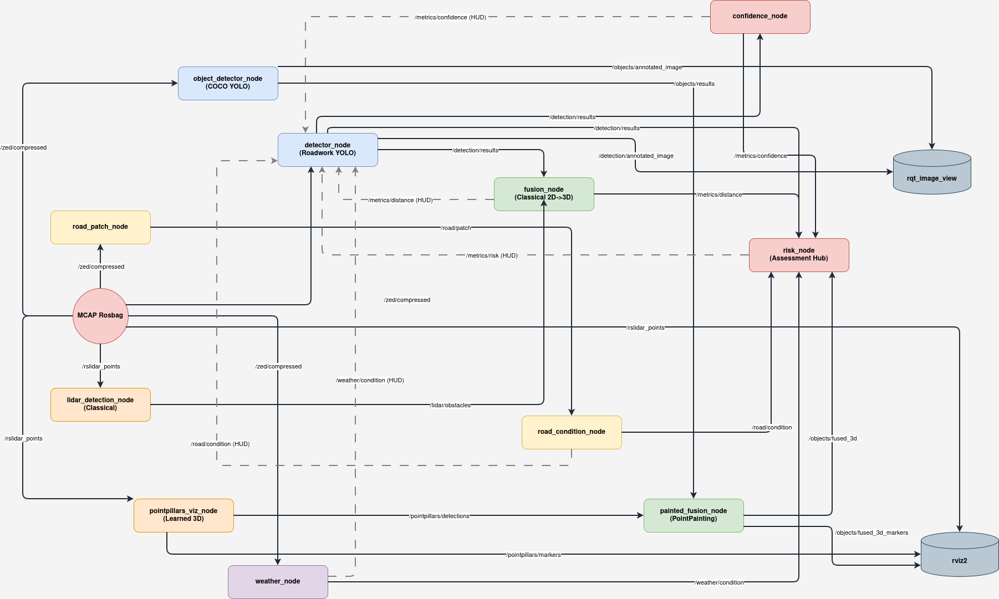

# ROS2 Autonomous Vehicle Perception Pipeline

Real-time roadwork detection, road condition estimation, and ODD (Operational Design Domain) exit risk assessment for autonomous vehicles. Built for ROS2 Humble.

## 📁 Repository Structure

```text
├── roadwork_detection/     # Roadwork object detection + LiDAR fusion + metrics
├── road_condition/         # Road surface condition estimation (dry/wet/snow)
├── weather_detection/      # Weather condition estimation (clear/fog/rain/snow)
├── object_detection/       # General object detection (Stock COCO YOLOv8)
├── risk_assessment/        # ODD exit risk assessment
└── OpenPCDet/              # Learned 3D point cloud detection (PointPillars)
```

## 📦 Packages

### 1. `roadwork_detection`
Camera + LiDAR fusion pipeline for roadwork object detection.
* **`detector_node`**: YOLOv8x TensorRT inference on ZED compressed images, metrics overlay.
* **`lidar_detection_node`**: Ground removal (RANSAC) + obstacle clustering from point cloud.
* **`fusion_node`**: Projects LiDAR 3D obstacles onto camera, matches with 2D detections.
* **`confidence_node`**: Per-frame roadwork existence probability with EMA smoothing.
* **`video_publisher_node`**: Reads mp4 files as ROS2 camera topic (for dataset testing).

### 2. `road_condition`
Road surface condition estimation using EfficientNet-B0.
* **`road_patch_node`**: Extracts road surface patch using camera projection (tire position).
* **`road_condition_node`**: Classifies patch as dry/wet/snow using EfficientNet-B0.

### 3. `weather_detection`
Environmental weather classification.
* **`weather_node`**: Classifies weather as clear/fog/rain/snow (ACDC + Boreas trained).

### 4. `object_detection` & Learned 3D Fusion
General dynamic object detection and point cloud painting.
* **`object_detector_node`**: Stock COCO YOLOv8x (80 classes).
* **`pointpillars_viz_node`**: Learned 3D bounding boxes via OpenPCDet (PointPillars/KITTI).
* **`painted_fusion_node`**: PointPainting (Vora et al. 2020) scoring re-rank by class agreement.

### 5. `risk_assessment`
ODD exit risk assessment combining distance + confidence + dynamic objects + environmental factors.
* **`risk_node`**: R_frame = max(R_d, R_c) with EMA smoothing.

---

## 🏗️ System Architecture

Here is the complete ROS 2 computational graph showing the data flow between our perception, fusion, and assessment nodes.



*(Note: The `distance_node` has been superseded by the `fusion_node` and is kept in the repository for legacy purposes).*

---

## 📡 Key Topics

| Topic | Type | Description |
|-------|------|-------------|
| `/detection/annotated_image` | Image | Frames with bboxes + metrics overlay |
| `/objects/annotated_image` | Image | Frames with COCO bboxes overlay |
| `/detection/results` | String | JSON roadwork detection data |
| `/objects/results` | String | JSON general object detection data |
| `/lidar/obstacles` | String | JSON 3D obstacle data |
| `/pointpillars/detections` | PointCloud2 | 3D bounding boxes from OpenPCDet |
| `/objects/fused_3d` | String | JSON fused 3D results (PointPainting) |
| `/metrics/distance` | Float64 | Nearest object distance (EMA) |
| `/metrics/confidence` | Float64 | Roadwork existence probability (EMA) |
| `/metrics/risk` | Float64 | ODD exit risk score (EMA) |
| `/road/condition` | String | Road condition: dry/wet/snow |
| `/weather/condition` | String | Weather condition: clear/fog/rain/snow |

---

## 🏷️ Datasets & Classes

**ROADWork Dataset (17 Classes):**
Police Officer, Police Vehicle, Cone, Fence, Drum, Barricade, Barrier, Work Vehicle, Vertical Panel, Tubular Marker, Arrow Board, Bike Lane, Work Equipment, Worker, Other Roadwork Objects, TTC Message Board, TTC Sign

**Training Metrics:**
* YOLOv8x fine-tuned on ROADWork dataset (Carnegie Mellon KiltHub): 5,318 images, 17 classes, mAP50 = 48.1%
* EfficientNet-B0 trained on Boreas road patches: 70,322 images, 3 classes (dry/snow/wet)

---

## ⚙️ Requirements & Setup

* Ubuntu 22.04 + ROS2 Humble
* Python 3.10
* NVIDIA GPU + TensorRT (RTX A5000 recommended)
* Ultralytics YOLOv8, PyTorch with CUDA
* TensorFlow (for road condition)

```bash
python3 -m venv ~/roadwork_project/venv --system-site-packages
source ~/roadwork_project/venv/bin/activate
pip3 install torch torchvision --index-url https://download.pytorch.org/whl/cu124
pip3 install ultralytics tensorrt tensorflow "numpy<2"
```

---

## 🚀 Execution (Tmux Pipeline)

We recommend using the provided bash scripts to manage the complex multi-node startup sequence. 

**Build the workspace:**
```bash
chmod +x build.sh
./build.sh
```

**Start the full pipeline (via tmux):**
```bash
chmod +x run_all.sh
./run_all.sh
```

**Stop the pipeline:**
```bash
chmod +x stop_all.sh
./stop_all.sh
```

*(Alternatively, you can attach to the tmux session using `tmux attach -t pipeline` to view the individual node logs).*

---

## 🧠 Model Weights

Swappable via config — place any trained model in the respective `models` folder:
* `roadwork_detection/models/yolov8x_roadwork.engine` — YOLOv8x TensorRT
* `road_condition/models/EfficientNet_training_N.keras` — EfficientNet-B0

---

## 📊 Paper Parameters (Table II)

| Parameter | Value |
|-----------|-------|
| EMA α_d (distance) | 0.15 |
| EMA α_c (confidence) | 0.15 |
| EMA α_r (risk) | 0.20 |
| λ (confidence weighting) | 0.50 |
| N_max (max detection count) | 12 |
| d_near | 5.0m |
| d_far | 30.0m |
| w_c (confidence weight) | 0.50 |
| w_d (dynamic object weight) | 0.50 |

---

## 📚 References

* ICCAR 2026: "Operational Design Domain Exit Detection and Risk Assessment for Roadworks Scenarios in Autonomous Vehicles"
* ROADWork Dataset: Carnegie Mellon KiltHub
* Boreas Dataset: University of Toronto
